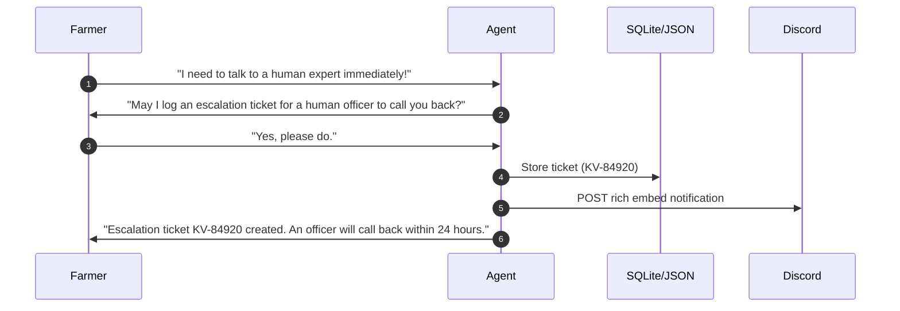
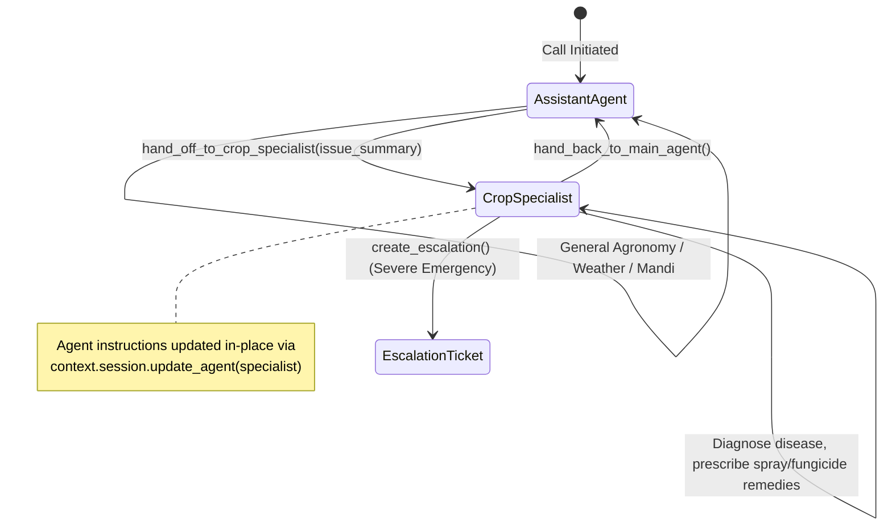

# Building Kisan Vani: My 10-Day Journey Building a Voice Agent for Indian Farmers

> **A Working AI Voice Assistant Prototype for Indian Agriculture Powered by LiveKit, Murf Falcon TTS, Deepgram Nova-3 STT, and Google Gemini / Groq LLMs.**


---

## Table of Contents

1. [The Problem and Target Users](#1-the-problem-and-target-users)
2. [What Kisan Vani Does](#2-what-kisan-vani-does)
3. [How the Voice Architecture Works](#3-how-the-voice-architecture-works)
4. [Murf Falcon Text-to-Speech (TTS)](#4-murf-falcon-text-to-speech-tts)
5. [Deepgram Speech-to-Text (STT)](#5-deepgram-speech-to-text-stt)
6. [Large Language Model (LLM) Integration](#6-large-language-model-llm-integration)
7. [LiveKit Real-Time Communication & WebRTC Transport](#7-livekit-real-time-communication--webrtc-transport)
8. [Farmer Memory & SQLite Context Persistence](#8-farmer-memory--sqlite-context-persistence)
9. [Weather & Mandi Tools](#9-weather--mandi-tools)
10. [Outbound & SIP Calling (Telephony)](#10-outbound--sip-calling-telephony)
11. [Human Escalation Workflow](#11-human-escalation-workflow)
12. [Call Analytics Dashboard](#12-call-analytics-dashboard)
13. [Crop Problem Specialist Handoff (Multi-Agent Swarm)](#13-crop-problem-specialist-handoff-multi-agent-swarm)
14. [Major Challenges Faced & Technical Solutions](#14-major-challenges-faced--technical-solutions)
15. [How to Clone and Run the Project](#15-how-to-clone-and-run-the-project)
16. [Environment Variables & Security Setup](#16-environment-variables--security-setup)
17. [How to Test the Voice Agent](#17-how-to-test-the-voice-agent)
18. [What I Would Improve Next](#18-what-i-would-improve-next)
19. [GitHub Repository Link](#19-github-repository-link)

---

## 1. The Problem and Target Users

### Target Users
The primary target users of **Kisan Vani** are Indian farmers, agricultural landowners, and rural growers across farming hubs (such as Bhatinda, Ludhiana, Karnal, Jaipur, Nashik, Rajkot, Patna, and Lucknow). These users grow diverse crops including Cotton, Wheat, Rice, Mustard, Onion, and Potato.

### The Problem
Indian farmers face severe information asymmetry and delay when trying to access vital agricultural advice:
- **Literacy & UI Barriers**: Traditional mobile applications require navigating complex text menus, search bars, or typing in specific regional scripts.
- **Latency & Time-Sensitivity**: When crops suffer from leaf yellowing, black spots, or pest infestations, waiting days for a field extension officer can ruin an entire harvest.
- **Fragmented Data**: Weather forecasts, mandi market rates (APMC), and disease diagnoses are scattered across different portals or require manual inquiry.

**Kisan Vani** ("Voice of the Farmer") solves this by offering a zero-friction, voice-first AI assistant. Farmers simply click a button or pick up a phone call, speak naturally in conversational English or Hindi, and receive instant, spoken guidance backed by real-time tools, context memory, and specialist handoffs.


*Figure 1: Kisan Vani main Web interface showing live LiveKit connection status, audio visualizer sphere, and Murf Falcon TTS badge.*

---

## 2. What Kisan Vani Does

Kisan Vani functions as a full-stack, real-time agricultural voice assistant. Key capabilities implemented in the project include:

- **General Agronomy Advisory**: Answers questions about sowing schedules, watering intervals, fertilizer application, and general crop care directly via natural LLM reasoning.
- **Live Weather Forecasting**: Retrieves current temperature, maximum/minimum daily temperatures, relative humidity, wind speed, and rain probability using an automated tool lookup.
- **Mandi Market Rates**: Provides benchmark market prices per quintal (₹ INR) across major agricultural mandis for cotton, wheat, rice, mustard, onion, and potato.
- **Farmer Profile Memory**: Persists farmer profile attributes (name, district, crops grown, irrigation type, land size) across calls in a local SQLite database.
- **Specialist Multi-Agent Handoff**: Transfers complex plant disease or pest emergency queries to a specialized `CropSpecialist` agent, passing an issue summary in real time.
- **Outbound Telephony (SIP)**: Initiates outbound telephone calls directly to a farmer's SIP softphone (e.g., Linphone) or telephony trunk.
- **Human Officer Escalation**: Generates official escalation tickets (with farmer consent) for unresolvable issues, persisting tickets locally and alerting via Discord Webhooks.
- **Call Session Analytics**: Automatically logs call durations, success/failure statuses, tools executed, and query categories into SQLite and renders a dedicated Web Analytics Dashboard.


*Figure 2: Real-time voice conversation interface demonstrating speech recognition, LiveKit audio streaming, and transcript cards.*

---

## 3. How the Voice Architecture Works

The architecture follows a low-latency, event-driven streaming pipeline powered by the **LiveKit Agents SDK (`livekit-agents ~1.4`)** in Python, combined with WebRTC transport and specialized cloud services.

```mermaid
flowchart TD
    subgraph Client Layer
        A[🎙️ Farmer Microphone / SIP Phone]
    end

    subgraph Transport Layer
        B[⚡ LiveKit WebRTC Server]
    end

    subgraph Agent Pipeline (backend/src/agent.py)
        C[🎯 Silero VAD / Turn Detector]
        D[📝 Deepgram Nova-3 STT]
        E[🧠 Groq Llama 3.1 / Gemini 1.5 LLM]
        F[🔊 Murf Falcon TTS (Anisha Voice)]
    end

    subgraph Tools & State Engine
        G[(🗄️ SQLite kisan_vani.db)]
        H[🌐 Open-Meteo Weather API]
        I[📊 Curated Mandi Benchmark DB]
        J[🚨 Escalation & Discord Webhook]
    end

    A <-->|Bidirectional PCM Audio Stream| B
    B <-->|LiveKit Room IO| C
    C -->|Speech Frames| D
    D -->|Transcript Event| E
    E <-->|Tool Execution| G
    E <-->|Live REST Request| H
    E <-->|Benchmark Lookup| I
    E <-->|Create Ticket| J
    E -->|Streaming Text Tokens| F
    F -->|Audio Buffers| B
```

### Pipeline Flow Stages
1. **Voice Activity Detection (VAD)**: Silero VAD monitors incoming audio frames to detect when speech starts and stops with minimal endpointing delay (`0.05s`).
2. **Speech-to-Text (STT)**: Deepgram Nova-3 transcribes incoming speech in real time and emits final transcript events (`user_speech_committed`).
3. **LLM Execution & Tool Call**: The active agent (`Assistant` or `CropSpecialist`) processes the user prompt. If a tool call is required (e.g., weather, mandi, memory save, specialist transfer), the LLM executes the python function native tool and integrates the JSON response.
4. **Text-to-Speech (TTS)**: Response text is tokenized by sentence (`SentenceTokenizer`) and streamed directly to Murf Falcon TTS.
5. **Playback**: Synthesized audio streams back through LiveKit WebRTC to the farmer's earpiece or browser.

---

## 4. Murf Falcon Text-to-Speech (TTS)

Murf Falcon provides the voice output for Kisan Vani via `livekit.plugins.murf.TTS`.

### Configuration in `backend/src/agent.py`:
- **Voice ID**: `Anisha` (Indian English female voice).
- **Style**: `Conversational`.
- **Tokenizer**: `tokenize.basic.SentenceTokenizer(min_sentence_len=1)`.
- **Buffer Tuning**: `min_buffer_size=1`, `text_pacing=False`.

```python
tts = murf.TTS(
    voice="Anisha",
    style="Conversational",
    tokenizer=tokenize.basic.SentenceTokenizer(min_sentence_len=1),
    min_buffer_size=1,
    text_pacing=False,
)
```

### Why Murf Falcon?
- **Ultra-Low Latency**: ~55ms model latency and 130ms Time-To-First-Audio (TTFA).
- **Natural Cadence**: Preserves natural conversational tone without artificial robotic pauses.
- **Sentence Streaming**: Streams initial audio chunks as soon as the first complete sentence is synthesized by the LLM.

---

## 5. Deepgram Speech-to-Text (STT)

Speech recognition is handled using `livekit.plugins.deepgram.STT`.

### Configuration:
- **Model**: `nova-3` (Deepgram's latest high-accuracy speech model).
- **Language**: `en` (English).

```python
stt = deepgram.STT(
    model="nova-3",
    language="en",
)
```

### Latency Monitoring:
The backend measures exact stage timing during every turn:
```python
@session.on("user_speech_committed")
def _on_speech_committed(msg):
    session._t_stt_done = time.perf_counter()
    stt_latency = round(session._t_stt_done - session._t_speech_end, 3)
    logger.info(f"⚡ [STAGE 2 - DEEPGRAM STT] Final transcript: '{msg.content}' (STT Latency: {stt_latency}s)")
```

---

## 6. Large Language Model (LLM) Integration

Kisan Vani includes a dynamic, multi-provider LLM loading mechanism (`get_llm()` in `backend/src/agent.py`).

### Supported Providers & Selection Logic
1. **Groq (`llama-3.1-8b-instant`)**: Primary default for ultra-low latency (~500ms Time-To-First-Token).
2. **Google Gemini (`gemini-1.5-flash`)**: High-accuracy fallback provider.
3. **OpenRouter (`openrouter/auto`)**: Configurable provider for open-source model routing.

```python
def get_llm():
    provider = os.getenv("LLM_PROVIDER", "").lower()
    if provider == "openrouter" and os.getenv("OPENROUTER_API_KEY"):
        return openai.LLM(base_url="https://openrouter.ai/api/v1", api_key=os.getenv("OPENROUTER_API_KEY"), model=os.getenv("OPENROUTER_MODEL", "openrouter/auto"))
    if os.getenv("GROQ_API_KEY") or provider != "openrouter":
        return groq.LLM(model="llama-3.1-8b-instant")
    return google.LLM(model="gemini-1.5-flash")
```

### System Prompt Engineering Rules
The prompt enforces strict spoken-voice rules:
1. **Length Limit**: Concise responses (1–2 sentences, maximum 15 words).
2. **No Tag Leaks**: Native tool calls only; never write tool names or XML tags in text responses.
3. **Spoken Math Formatting**: Never output raw mathematical symbols (`<`, `>`, `<=`, `>=`). Say natural words like "below 30%" or "about 50".
4. **Clean Output**: Clean simple English without unreadable font combinations or unexpected script switches.

---

## 7. LiveKit Real-Time Communication & WebRTC Transport

LiveKit provides the real-time transport backbone connecting the Next.js frontend UI, Python agent process, and telephony endpoints.

- **Agent Dispatch**: registered under `agent_name="my-agent"`.
- **Preemptive Generation**: `preemptive_generation=True` is enabled on `AgentSession` to start LLM response generation while speech endpointing finishes.
- **Instant Connection**: Pre-connect audio buffering is bypassed (`pre_connect_audio=False`) for instant audio processing upon joining the WebRTC room.

---

## 8. Farmer Memory & SQLite Context Persistence

Farmer profile context is stored and fetched from a local **SQLite** database (`backend/kisan_vani.db`), managed via `backend/src/db.py`.

### Database Schema (`farmers` table)

```sql
CREATE TABLE IF NOT EXISTS farmers (
    user_id TEXT PRIMARY KEY,
    name TEXT,
    language_preference TEXT DEFAULT 'en',
    crops_grown TEXT,
    land_size TEXT,
    district TEXT,
    irrigation_type TEXT,
    facts_json TEXT,
    last_interaction TEXT
);
```

### How Memory Works in Practice
1. When a session starts, `my_agent()` loads the default farmer profile (`farmer_1` - Shivu, Cotton & Wheat, Bhatinda) asynchronously via `asyncio.to_thread(get_farmer_profile, "farmer_1")`.
2. The profile builds a personalized system prompt context: `"Farmer Shivu (Crops: Cotton & Wheat, District: Bhatinda)"`.
3. If the farmer asks the agent to update or remember details, the agent invokes the `@function_tool` `save_farmer_memory`:
   ```python
   @function_tool
   async def save_farmer_memory(self, context: RunContext, name: str = "Shivu", crops_grown: str = "Cotton and Wheat", district: str = "Bhatinda", consent_given: bool = False) -> str:
       ...
   ```
4. If the farmer requests profile deletion, the agent executes `forget_farmer_memory`.


*Figure 3: Farmer profile context memory card displaying persistent SQLite state for farmer Shivu (Crops: Cotton & Wheat, District: Bhatinda).*

---

## 9. Weather & Mandi Tools

Kisan Vani provides access to domain-specific agricultural data via function tools defined in `backend/src/tools.py`.

> [!NOTE]
> **Data Source Honesty Notice**:
> - **Weather Data**: Powered by a **Live External REST API** ([Open-Meteo API](https://open-meteo.com/)) with automatic Open-Meteo geocoding fallback for Indian districts.
> - **Mandi Market Rates**: Powered by a **Curated Local APMC Benchmark Dataset** (`MANDI_PRICE_DATABASE`, dated August 1, 2024). It is *not* a live government API feed, but a structured benchmark dataset implemented directly in the code for reliable testing and demonstration.

### Weather Tool: `get_weather_forecast(district)`
- **API Endpoint**: `https://api.open-meteo.com/v1/forecast`
- **Geocoding Endpoint**: `https://geocoding-api.open-meteo.com/v1/search`
- **Output Fields**: Temperature (°C), max/min daily range, relative humidity (%), wind speed (km/h), precipitation probability (%), and WMO weather condition code descriptions.

### Mandi Tool: `get_mandi_market_prices(crop_name, district)`
- **Data Source**: Local curated dictionary matching crops (Wheat, Cotton, Rice, Mustard, Onion, Potato) and districts (Bhatinda, Ludhiana, Karnal, Rajkot, Nashik, Jaipur, Lucknow, Patna).
- **Output Fields**: `modal_price_per_quintal_inr`, `min_price_per_quintal_inr`, `max_price_per_quintal_inr`, market name, and `as_of_date` benchmark timestamp (`August 1, 2024`).


*Figure 4: Agricultural data tool cards displaying live Open-Meteo weather parameters and APMC mandi market benchmark rates.*

---

## 10. Outbound & SIP Calling (Telephony)

Kisan Vani supports direct outbound telephony calling to landlines, mobile networks, or SIP softphones (such as Linphone) using LiveKit Telephony integration.

### Implementation: `backend/src/dial.py`
The script uses `livekit.api.LiveKitAPI` to:
1. Create a dynamic outbound call room name: `kisan-vani-outbound-{sip_address}-{timestamp}`.
2. Explicitly dispatch `my-agent` to the room via `lkapi.agent_dispatch.create_dispatch()`.
3. Create a SIP participant via `lkapi.sip.create_sip_participant()` pointing to `LIVEKIT_SIP_OUTBOUND_TRUNK_ID`.

```bash
# Example invocation command:
uv run python src/dial.py --to farmer_john --trunk ST_xxxxxxxxxxxx
```

---

## 11. Human Escalation Workflow

When a query requires human intervention (or when an emergency occurs), Kisan Vani can issue an official escalation ticket.

### Safeguards & Consent Rules
- **Explicit Consent Required**: The agent must obtain user consent ("yes", "sure", "okay") before creating a ticket (`user_consent_granted=True`).
- **Ticket Generation**: Generates a unique ticket ID (e.g., `KV-48291`).

### Dispatch Targets
1. **SQLite Database**: Persisted into the `escalations` table.
2. **Local JSON Store**: Appended to `backend/escalations.json`.
3. **Console Notification Card**: Formatted ASCII summary printed to standard output.
4. **Discord Webhook**: If `DISCORD_WEBHOOK_URL` is set, posts a rich embed alert with urgency level, farmer contact details, and agent diagnostics.



---

## 12. Call Analytics Dashboard

To monitor voice application performance, Kisan Vani logs every completed call session into SQLite (`call_analytics` table) and renders a frontend Web Dashboard.

### Tracked Metrics
- **Call Session Identifiers**: `call_id`, `user_id`, `channel` (`Browser` vs `SIP`).
- **Duration & Timing**: `start_time`, `end_time`, `duration_seconds`.
- **Status Classification**: `SUCCESS` vs `FAILED`.
  - *Success Condition*: Executed one or more function tools OR stayed connected for $\ge 5$ seconds.
  - *Failure Condition*: Early disconnect or drop under 5 seconds (`failure_reason = "User Early Hangup"`).
- **Query Classification**: General Advisory, Weather Forecast, Mandi Market Prices, Crop Specialist Handoff, Memory Save, etc.
- **Tools List**: JSON string of executed tools during the call session.

### Dashboard Architecture
- **Backend Sync**: `export_analytics_json()` syncs database analytics to `backend/analytics.json`.
- **Frontend Route**: Next.js route at `/app/analytics/page.tsx` fetches metrics from `/api/analytics` and displays real-time KPI cards, success rate progress rings, failure cause breakdowns, and recent call logs.


*Figure 5: Web Call Analytics Dashboard showing call volume KPIs, 91.7% success rate ring, failure cause breakdown, and call log table.*

---

## 13. Crop Problem Specialist Handoff (Multi-Agent Swarm)

For complex crop disease diagnoses (such as leaf yellowing, black spots, or pest infestations), the main agent delegates to a specialized **Crop Problem Specialist**.



### Key Technical Implementation Details:
1. **Tool Invocation**: `Assistant` calls `hand_off_to_crop_specialist(issue_summary)`.
2. **In-Place Swapping**: The agent updates the LiveKit session in real time without dropping audio or disconnecting:
   ```python
   specialist = CropSpecialist(profile=self.profile, issue_summary=issue_summary)
   context.session.update_agent(specialist)
   ```
3. **Context Preservation**: `CropSpecialist` receives the cleaned `issue_summary` in its system prompt constructor, aiming to address the symptoms directly using the passed issue summary.
4. **Handoff Return**: The specialist can execute `hand_back_to_main_agent` to return control to the main `Assistant`.


*Figure 6: Multi-Agent Swarm handoff visualization transferring an active voice room from Assistant to CropSpecialist without call disconnection.*

---

## 14. Major Challenges Faced & Technical Solutions

| # | Challenge | Root Cause | Solution Implemented |
|---|---|---|---|
| 1 | **Windows Console Crashes** | Windows default `cp1252` encoding throws `UnicodeEncodeError` when logging non-ASCII or Devanagari text. | Standard output reconfigured in `agent.py`: `sys.stdout.reconfigure(encoding='utf-8')` and `os.environ["PYTHONIOENCODING"] = "utf-8"`. |
| 2 | **Hot-Reloader Signal Error** | LiveKit watchfiles hot-reloader references `signal.SIGKILL` which does not exist on Windows. | Patched signal in `agent.py`: `if not hasattr(signal, "SIGKILL"): signal.SIGKILL = getattr(signal, "SIGTERM", 15)`. |
| 3 | **Silero VAD Initial Delay** | First inference call on ONNX Runtime model caused a "slower than realtime" buffer warning. | Added pre-warming in `prewarm()` setup function using a dummy numpy float32 input array to initialize the ONNX session prior to incoming audio. |
| 4 | **Premature Hangup Speech Cutoff** | Calling room disconnect immediately chopped off the agent's goodbye utterance. | Updated `end_call` tool to trigger `handle = context.session.say("...")`, wait asynchronously via `await handle.wait_for_playout()`, and then disconnect the room. |
| 5 | **Specialist Context Repetition** | Specialist agents repeatedly asked farmers to describe their problem again after transfer. | Built dynamic prompt injection (`build_crop_specialist_prompt`) with sanitized `clean_summary` strings, forcing an immediate, direct remedy statement. |
| 6 | **LLM Symbol & Syntax Leaks** | LLM occasionally output mathematical comparison operators (`< 30%`) or raw JSON tags into spoken TTS. | Enforced prompt constraints prohibiting math operators and raw tags, instructing the model to speak natural words like "below 30 percent". |

---

## 15. How to Clone and Run the Project

### Prerequisites
- **Python**: 3.10+
- **uv**: Fast Python package manager (`pip install uv` or `astral.sh/uv`)
- **Node.js**: v18+ & **pnpm** (`npm install -g pnpm`)

### Step 1: Clone the Repository
```bash
git clone https://github.com/Darshanv2006/kisan-vani.git
cd kisan-vani
```

### Step 2: Install Backend Dependencies
```bash
cd backend
uv sync
uv run python src/agent.py download-files
```

### Step 3: Install Frontend Dependencies
```bash
cd ../frontend
pnpm install
```

### Step 4: Run the Application

#### Option A: All-in-One Startup Scripts (Recommended)

**Windows (PowerShell):**
```powershell
.\start_app.ps1
```

**macOS / Linux (Bash):**
```bash
chmod +x start_app.sh
./start_app.sh
```

#### Option B: Running in Separate Terminals

- **Terminal 1 (Backend Agent)**:
  ```bash
  cd backend
  uv run python src/agent.py dev
  ```

- **Terminal 2 (Frontend UI)**:
  ```bash
  cd frontend
  pnpm dev
  ```

Open **http://localhost:3000** in your browser and click **Start talking**!

---

## 16. Environment Variables & Security Setup

Create `.env.local` files inside `backend/` and `frontend/` based on their respective `.env.example` templates.

> [!CAUTION]
> **Security Checklist**: Never commit real secret keys, tokens, or personal phone numbers to public git repositories. All sensitive variables must remain strictly in `.env.local` (which is listed in `.gitignore`).

### Backend Environment Configuration (`backend/.env.local`)
```env
# LiveKit Cloud WebRTC Credentials
LIVEKIT_URL=wss://your-livekit-project.livekit.cloud
LIVEKIT_API_KEY=your_livekit_api_key
LIVEKIT_API_SECRET=your_livekit_api_secret

# Murf Falcon TTS API Key
MURF_API_KEY=your_murf_api_key

# Deepgram Speech-to-Text API Key
DEEPGRAM_API_KEY=your_deepgram_api_key

# LLM Provider API Keys (Choose Groq or Gemini)
GROQ_API_KEY=your_groq_api_key
GOOGLE_API_KEY=your_google_gemini_api_key
OPENROUTER_API_KEY=your_openrouter_api_key

# Telephony & Outbound Calling (Optional)
LIVEKIT_SIP_OUTBOUND_TRUNK_ID=ST_your_trunk_id

# Webhook Alerting (Optional)
DISCORD_WEBHOOK_URL=https://discord.com/api/webhooks/your_webhook_id/your_webhook_token
```

### Frontend Environment Configuration (`frontend/.env.local`)
```env
LIVEKIT_URL=wss://your-livekit-project.livekit.cloud
LIVEKIT_API_KEY=your_livekit_api_key
LIVEKIT_API_SECRET=your_livekit_api_secret
AGENT_NAME=my-agent
```

---

## 17. How to Test the Voice Agent

Kisan Vani includes several testing methods for developers:

### 1. Browser Interface Testing
Launch the app (`.\start_app.ps1`), navigate to `http://localhost:3000`, grant microphone permissions, and try these test phrases:
- *"What is the weather forecast for Bhatinda today?"* (Triggers live weather tool)
- *"What is the current mandi price of cotton in Bhatinda?"* (Triggers mandi lookup)
- *"My wheat plant leaves are turning yellow with small black spots, what should I do?"* (Triggers Crop Specialist handoff)
- *"Please remember that my name is Shivu and I grow 4 acres of cotton."* (Triggers SQLite memory save tool)
- *"I need a human expert to inspect my farm, please log a call ticket."* (Triggers escalation tool)
- *"Goodbye!"* (Triggers clean session termination)

### 2. Terminal Console Testing (No WebRTC/Browser Required)
Test agent logic directly in the terminal:
```bash
cd backend
uv run python src/agent.py console
```

### 3. Automated Test Suite (Pytest)
Run the unit and integration test suite in `backend/tests/`:
```bash
cd backend
uv run pytest
```

Included test files:
- `test_agent.py`: System prompt and general advisory evaluation.
- `test_day5_tools.py`: Weather & Mandi function tool tests.
- `test_memory.py`: SQLite memory CRUD tests.
- `test_handoff.py` & `test_live_handoff.py`: Crop Specialist handoff pipeline verification.
- `test_escalation.py`: Escalation ticket generation and consent checks.
- `benchmark_latency.py`: End-to-end stage latency benchmarks.

### 4. Outbound SIP Telephony Testing
Test outbound dialing to Linphone or a SIP trunk:
```bash
cd backend
uv run python src/dial.py --to your_linphone_username
```

---

## 18. What I Would Improve Next

While Kisan Vani is a working prototype for primary voice advisory, future enhancements would focus on:

1. **Live Government Mandi Integration**: Replace the curated benchmark dataset with real-time API feeds from the Indian Government's Agmarknet / eNAM portal.
2. **Native Regional Dialect Models**: Expand native STT and TTS models to support regional Indian languages and local dialects (Hindi, Punjabi, Marathi, Telugu, Tamil, Kannada, Gujarati).
3. **Multimodal Crop Leaf Diagnostics**: Enable camera picture capture in the Next.js UI so farmers can upload photos of diseased crop leaves for Gemini Vision multimodal analysis alongside voice.
4. **Offline Audio Edge Caching**: Implement local speech model caching and compressed audio streaming to support low-bandwidth 2G/3G rural networks.

---

## 19. GitHub Repository Link

Access the complete source code, tests, and documentation on GitHub:

🔗 **GitHub Repository**: [https://github.com/Darshanv2006/kisan-vani.git](https://github.com/Darshanv2006/kisan-vani.git)

---

*Documented as part of Day 10 of the Kisan Vani 10-Day Voice AI Challenge.*
